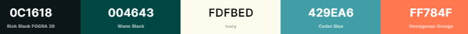

## Table of Contents
1. [**Purpose**](#purpose)
1. [**UX**](#user-experience)
    - [**User Stories**](#user-stories)
    - [**Structure**](#structure)
    - [**Design**](#design)
        - [**Framework**](#framework)
        - [**Colour Scheme**](#colour-scheme)
        - [**Icons**](#icons)
        - [**Typography**](#typography)
    - [**Wireframes**](#wireframes)

2. [**Features**](#features)
    - [**Existing Features**](#existing-features)
    - [**Features Left to Implement**](#features-left-to-implement)

3. [**Technologies Used**](#technologies-used)
    - [**Front-End Technologies**](#front-end-technologies)
    - [**Back-End Technologies**](#back-end-technologies)
    - [**Database Schema**](#database-schema)

4. [**Testing**](#testing)

5. [**Deployment**](#deployment)
    - [**Local Deployment**](#local-deployment)
    - [**Remote Deployment**](#remote-deployment)

6. [**Credits**](#credits)
    - [**Content**](#content)
    - [**Media**](#media)
    - [**Code**](#code)
 

# **Keeping-fit**
## **Purpose**
---
**Keeping-fit** was designed with the purpose of helping users create and share workouts.**Keeping-fit** is also a way of keeping track of your goals for losing weight or getting stronger.  
Once you Create an account you are albe to create your own personal workouts, share your personal workout or create workouts to be shared. You can also create keep track of your goals!
 ## **User Experience**
---
### **User stories**
-  As a user I want to have a clear idea of what the application is about upon visiting the site.
-  As a user I would like to be able to create my own account.
-  As a user I want to be able to create and view workouts.
-  As a user I want to be able to edit and delete my workouts.
-  As a user I would like to be able to share my workouts with others.
- As a user I would like to be able to view workouts shared by others.
-  As a user I would like to be able to create,view,edit and delete goals that I have.
- As a user I want to be able to save shared workouts so I can view them later.
-  As I would like to be able to give each workout difficulty score so i know which workouts are harder then others.
- As a user I want to be able to search workouts so I can easily find specific workouts.
## **Structure**
The Home page Contains 3 Sections, each of these sections give the relavant information about the application
 This fufils the user story:
> As a user I want to have a clear idea of what the application is about upon visiting the site.

To use this application each user will have to create an account
 This fufils the user story:

> As a user I would like to be able to create my own account.

Once you log in you will be directed to your profile page where you can access your goals and upload a profile picture.
 This fufils the user story:

> As a user I would like to be able to create,view,edit and delete goals that I have.

The Workout page has search bar and an add workout button. You can also view all your previously created workouts, each workout card has and edit delete and share button
 This fufils the user stories:

> As a user I want to be able to create and view workouts. 
> As a user I want to be able to edit and delete my workouts. 
> As a user I would like to be able to share my workouts with others. 
> As I would like to be able to give each workout difficulty score so i know which workouts are harder then others. 

The Shared Workouts page has a search bar and all the workouts shared by others each workout card has a save button 
 This fufils the user stories:

> As a user I want to be able to save shared workouts so I can view them later. 
> As a user I would like to be able to view workouts shared by others. 
> As a user I want to be able to search workouts so I can easily find specific workouts.
### **Design**
---
### **Frameworks**

[Bootstrap](https://getbootstrap.com/)
- Bootstrap useage largely focuses on the responsiveness aspect of the appliaction

[mdbootstrap](https://mdbootstrap.com/)
- mdbootstrap was used for most of elements on each page such as the cards buttons and modals. 

[JQuery v3.5.1](https://jquery.com/)
-  JQuery was used to cut down on javascript code

[Flask](https://flask.palletsprojects.com/en/1.1.x/)
- Flask is a microframework that I've used to render the back-end Python with the front-end.

### **Colour Scheme**

  
<h2  id="top"></h2>

### **Icons**
- [Font Awesome Icons](https://fontawesome.com/)
    - All the icons used across this website were taken from Font Awesome and styled to match the colour scheme.

### **Typography**

- [**Oswald**](https://fonts.google.com/specimen/Oswald?query=os)
    - The primary font across the website.
    - Oswald was used for the headings and navigation bar
    - Oswald was chosen due its distinct style.

- [**Ubuntu**](https://fonts.google.com/specimen/Ubuntu?query=ubu)
    - The secondary font across the website.
    - Ubuntu was used for the paragraph texts and buttons.
    - Ubuntu was chosen because it pairs well with oswald.

### **Wireframes**

- Desktop
    - [Home Page](wireframes/Homedesktop.png)
    - [Profile Page](wireframes/profiledesktop.png)
    - [Workout](wireframes/workoutdesktop.png)
    - [Log in](wireframes/logdesktop.png)

- Tablet
    - [Home Page](wireframes/hometablet.png)
    - [Profile Page](wireframes/profiletablet.png)
    - [Workout](wireframes/workouttablet.png)
    - [Log in](wireframes/logtablet.png)

- Mobile
    - [Home Page](wireframes/hometablet.png)
    - [Profile Page](wireframes/profiletablet.png)
    - [Workout](wireframes/workouttablet.png)
    - [Log in](wireframes/logtablet.png)

### **Existing Features**
###  **Features on every page**