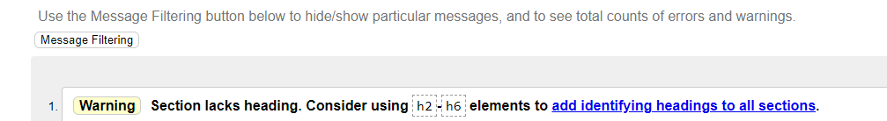
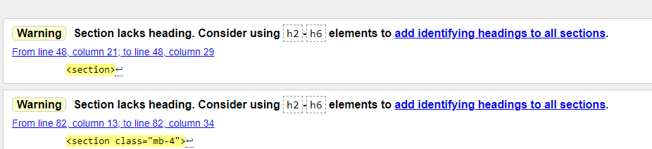
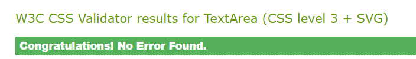
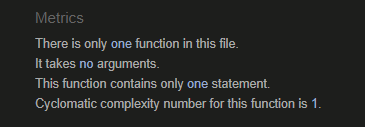

## Table of Contents
1. [**Purpose**](#purpose)
1. [**UX**](#user-experience)
    - [**User Stories**](#user-stories)
    - [**Structure**](#structure)
    - [**Design**](#design)
        - [**Framework**](#framework)
        - [**Colour Scheme**](#colour-scheme)
        - [**Icons**](#icons)
        - [**Typography**](#typography)
    - [**Wireframes**](#wireframes)
2. [**Features**](#features)
    - [**Existing Features**](#existing-features)
    - [**Features Left to Implement**](#features-left-to-implement)
3. [**Technologies Used**](#technologies-used)
    - [**Front-End Technologies**](#front-end-technologies)
    - [**Back-End Technologies**](#back-end-technologies)
    - [**Database Schema**](#database-schema)
4. [**Testing**](#testing)
    - [**Code Testing**](#code-testing)
    - [**Validator Testing**](#validator-testing)
    - [**User Story Testing**](#User-Story-Testing)
    - [**Manual Testing**](#manual-testing)
    - [**Lighthouse**](#lighthouse)
    - [**Responsive Testing**](#responsive-testing)
    - [**Bug Report**](#bug-report)
5. [**Deployment**](#deployment)
    - [**GitHub Pages**](#using-github-pages)
    - [**Locally**](run-locally)
    - [**Forking**](forking)
    - [**Making a Local Clone**](#making-a-local-clone)
    - [**Remote Deployment**](#remote-deployment)

6. [**Credits**](#credits)
    - [**Content**](#content)
    - [**Media**](#media)
    - [**Code**](#code)
<br>

# **Keeping-fit**
## **Purpose**
---
**Keeping-fit** was designed with the purpose of helping users create and share workouts.**Keeping-fit** is also a way of keeping track of your goals for losing weight or getting stronger.<br><br>
Once you Create an account you are albe to create your own personal workouts, share your personal workout or create workouts to be shared. You can also create keep track of your goals!
 ## **User Experience**
---
### **User stories**
-  As a user I want to have a clear idea of what the application is about upon visiting the site.
-  As a user I would like to be able to create my own account.
-  As a user I want to be able to create and view workouts.
-  As a user I want to be able to edit and delete my workouts.
-  As a user I would like to be able to share my workouts with others.
- As a user I would like to be able to view workouts shared by others.
-  As a user I would like to be able to create,view,edit and delete goals that I have.
- As a user I want to be able to save shared workouts so I can view them later.
-  As I would like to be able to give each workout difficulty score so i know which workouts are harder then others.
- As a user I want to be able to search workouts so I can easily find specific workouts.
## **Structure**
The Home page Contains 3 Sections, each of these sections give the relavant information about the application
<br>This fufils the user story:
> As a user I want to have a clear idea of what the application is about upon visiting the site.

To use this application each user will have to create an account
<br>This fufils the user story:

> As a user I would like to be able to create my own account.

Once you log in you will be directed to your profile page where you can access your goals and upload a profile picture.
<br>This fufils the user story:

> As a user I would like to be able to create,view,edit and delete goals that I have.

The Workout page has search bar and an add workout button. You can also view all your previously created workouts, each workout card has and edit delete and share button
<br>This fufils the user stories:

> As a user I want to be able to create and view workouts.<br>
> As a user I want to be able to edit and delete my workouts.<br>
> As a user I would like to be able to share my workouts with others.<br>
> As I would like to be able to give each workout difficulty score so i know which workouts are harder then others.<br>

The Shared Workouts page has a search bar and all the workouts shared by others each workout card has a save button 
<br>This fufils the user stories:

> As a user I want to be able to save shared workouts so I can view them later.<br>
> As a user I would like to be able to view workouts shared by others.<br>
> As a user I want to be able to search workouts so I can easily find specific workouts.
### **Design**
---
### **Frameworks**

[Bootstrap](https://getbootstrap.com/)
- Bootstrap useage largely focuses on the responsiveness aspect of the appliaction

[mdbootstrap](https://mdbootstrap.com/)
- mdbootstrap was used for most of elements on each page such as the cards buttons and modals. 

[JQuery v3.5.1](https://jquery.com/)
-  JQuery was used to cut down on javascript code

[Flask](https://flask.palletsprojects.com/en/1.1.x/)
- Flask is a microframework that I've used to render the back-end Python with the front-end.

### **Colour Scheme**

<br><br>
<h2  id="top"></h2>

### **Icons**
- [Font Awesome Icons](https://fontawesome.com/)
    - All the icons used across this website were taken from Font Awesome and styled to match the colour scheme.

### **Typography**

- [**Oswald**](https://fonts.google.com/specimen/Oswald?query=os)
    - The primary font across the website.
    - Oswald was used for the headings and navigation bar
    - Oswald was chosen due its distinct style.

- [**Ubuntu**](https://fonts.google.com/specimen/Ubuntu?query=ubu)
    - The secondary font across the website.
    - Ubuntu was used for the paragraph texts and buttons.
    - Ubuntu was chosen because it pairs well with oswald.

### **Wireframes**

- Desktop
    - [Home Page](wireframes/Homedesktop.png)
    - [Profile Page](wireframes/profiledesktop.png)
    - [Workout](wireframes/workoutdesktop.png)
    - [Log in](wireframes/logdesktop.png)

- Tablet
    - [Home Page](wireframes/hometablet.png)
    - [Profile Page](wireframes/profiletablet.png)
    - [Workout](wireframes/workouttablet.png)
    - [Log in](wireframes/logtablet.png)

- Mobile
    - [Home Page](wireframes/hometablet.png)
    - [Profile Page](wireframes/profiletablet.png)
    - [Workout](wireframes/workouttablet.png)
    - [Log in](wireframes/logtablet.png)

### **Existing Features**

### **Register page**
The register page is a very basic it consists of a simple form where a user will
- Create a username
- Input an email address
- Create a password 
- Confirm password

### **Log in page**
The Log in page is very similiar to the register page to log in each user will have to fill out he form with 
- Username 
- Password

### **Home page**
The Home page contains a navbar with links to the workouts page saved workouts page and a small profile picture. when this profile picture is click you can access the profile page or log out function.If you are not logged in the navbar will have options to log in and register<br>
The Home page contains 3 images and 3 paragraphs of text describing the application and how to access the application.<br>
The Home page also contains a footer with links to all of **Keeping-fits's** social media.

### **Profile page**
The profile page contains a navbar and footer which are the exact same as the Home page.<br>
on the profile page you are given the ability to Create Read Update and Delete goals.<br>
The Goals are displayed on a card that has the title of the goal description of the goal and edit and delte buttons.<br>
The profile page also contains a camera icon which gives you the ability to upload a profile photo which will be displayed above the goals.<br>
The profile page also has a smaller navbar that allows the user to filter between completed and inprogress goals.

### **Workouts page**
The Workouts page contains a navbar and footer the same as the previous pages.<br>
On the Workouts page you are also give the functionality to Create Read Update and Delete Workouts.<br>
Each Workout is displayed on a card that contains the title of workout, the description of the workout and difficultly of the workout(1-5) Each card has a edit delte and share button.<br>
The Share button will share this workout with other users and it will be displayed on the shared workouts page.<br>
At the top of the page there is a search bar that allows users to search through wourkouts by title.
### **Shared Workouts page**
The Shared workouts page has the same layout as the workouts page.<br>
The Shared workouts page contains cards similiar to the workouts page but displays the users profile picture that created the workout.<br>
if you created the workout you will have the option to edit and delete it.<br>
if you did not create the workout page you will have the option to save it.<br>
This page also has a smaller navbar that allows the users to filter between all the workouts and the workouts they saved.
## Features left to implement

There were several features planned for the future implentation of this project.

(1) Liking Shared Workouts
 - I would like to add a like button and counter to each shared workout card.

(2) Adding friends
- I would like to give users the ability to add each other friends to make a social network for users to compare and compete to add a competitive  element to the application

(3) Tracking activity
- I would like to add a calendar to the profile page that will track the users activity on the application to see which days they are most active

---

## **Technologies Used** 
---
- ### **Front End Technologies**
    - HTML
    - CSS
    - Javascript
    - [**JQuery**](https://jquery.com/) to simplify DOM manipulation.
    - [**MDBoostrap**](https://mdbootstrap.com/) a front end framework used to create responsive aspects across the site. 
    - [**Font Awesome**](https://fontawesome.com/) Font awesome Icons are used for the Social media links contained in the Footer section of the website.
    - [**Google Fonts**](https://fonts.google.com/) Google fonts are used throughout the project.

- ### **Back End Technologies**
    - Python - The back-end programming language.
    - [**Flask**](https://flask.palletsprojects.com/en/2.0.x/) Used as the framework.
    - [**Jinja**](https://jinja.palletsprojects.com/en/3.0.x/)  Used for templating with Flask.
    - [**Heroku**](https://www.heroku.com/) to host the application
    - [**Pymongo**](https://pypi.org/project/pymongo/) Used to connect the python with the database.
    - [**MongoDB**](https://www.mongodb.com/) Used to store the database.

- ### **Other Technologies** 
    - [**Gitpod**](http://gitpod.io/) the cloud based IDE used for development 
    - [**Github**](https://github.com/) to store and share all project code remotely.
    - [**Balsamiq**](https://balsamiq.com/?gclid=Cj0KCQjwo6D4BRDgARIsAA6uN1-NxDOthq9pGqYzB_1iRxlBvHVwi_4_LaZuGqQT46csctF0xCiTXUMaAqmuEALw_wcB) used to create wireframes.


- The application uses `MongoDB` for data storage.  MongoDB was chosen as the database to use due to the unstructured format of the data that will be stored within it. 

The data stored in the database are the following:
- Object ID
- String
- Boolean

There are four core collections within the Database: 

**users**

Key in db | Data type |
--- | --- | 
_id | ObjectId 
email | string
username | string
password | string

**Goals**

Key in db | Data type |
--- | --- | 
_id | ObjectId 
user | string
date | string
title | string
details | string
completed | string

**sharedworkouts**

Key in db | Data type |
--- | --- | 
_id | ObjectId 
user | string
date | string
title | string
routine | string
difficulty | string
savedby | array


**Workouts**

Key in db | Data type |
--- | --- | 
_id | ObjectId 
user | string
date | string
title | string
routine | string
difficulty | string
shared | boolean


**files**

Key in db | Data type |
--- | --- | 
_id | ObjectId 
id | string
profile_image_name | string

**fs.chunks**

Key in db | Data type |
--- | --- | 
_id | ObjectId 
files_id| ObjectId 
n | int32
data | binary

**fs.files**

Key in db | Data type |
--- | --- | 
_id | ObjectId 
filename | string
contentType | string
md5 | string
chunkSize | int32
length | int64
uploadDate | date


## **Testing** 
---
### **Code Testing**
#### **validator testing**
[W3C Markup Validation](https://validator.w3.org/)

W3C Markup Validation was used to validate both the HTMl and CSS for this application.
- No errors were noted in the CSS 
- No errors were noted in the HTML
- 2 Warnings were given.

One of these warnings was for the lack of headings, and the other was for having an empty heading. I think i got these warnings because the card headings were div elements not heading elements which would fill up most of the pages, and the empty heading element was from the edit profile picture icon that was inside a h1 element 

**Warning one**
<h2 align=center id="top"></h2>


**Warning Two**
<h2 align=center id="top"></h2>

**CSS**
<h2 align=center id="top"></h2>

[JSHint](https://jshint.com/)

 **Metrics**

- There 1 functions in this file.

- It takes no arguments.

- This function contains one statement

- Cyclomatic complexity number for this function is 1.

<h2 align=center id="top"></h2>


[pep8](http://pep8online.com/)

All Python code was check in the [pep8](http://pep8online.com/) validator these were the results.

- <h2 align=center id="top"></h2>


### **User Story Testing**

1.  As a user I want to have a clear idea of what the application is about upon visiting the site.
    - The Home page has 3 sections which contains details about what the application is how it works and how to sign up.
2.  As a user I would like to be able to create my own account.
    - Each User will have to create an account on that register page and login their account to use this application.
3.  As a user I want to be able to create and view workouts.
    - The My Workouts page allows you to create and view private workouts.
4.  As a user I want to be able to edit and delete my workouts.
    - Each Workouts card contains two buttons a button to edit that workout or to delete that workout
5.  As a user I would like to be able to share my workouts with others.
    - Each Workout card will contain a button that allows a user to share that specific workout, Once that workout is shared the button will update.
6. As a user I would like to be able to view workouts shared by others.
    - The All Workouts page contains all the workouts shared by you and others
7.  As a user I would like to be able to create,view,edit and delete goals that I have.
    - The profile page contains the CRUD functionality for the goals section
8. As a user I want to be able to save shared workouts so I can view them later.
    - Workouts that are not created by you on the all workouts page will have a save button this can be viewed in the saved all workouts page.
9.  As I would like to be able to give each workout difficulty score so i know which workouts are harder then others.
    - When creating every workout you are required to give it a difficulty
10. As a user I want to be able to search workouts so I can easily find specific workouts.
    - The All workouts and my workouts page have search bars that allows users to search workouts by their title.

### **Manual Testing**

manual testing was completed to make sure each page was fully responsive.

#### **Lighthouse**

A desktop Lighthouse report was completed on Word-Connect's website
The results were as follows:
<h2 align=center id="top"></h2>

A mobile Lighthouse report was completed on Word-Connect's website
The results were as follows:
<h2 align=center id="top"></h2>

### **Desktop Testing**
-
    | Page | Responsive| Notes| 
    --- | --- | ---
    Home | Y | Fully Responsive.
    Myworkouts | Y | Fully Responsive.  
    AllWorkouts | Y | Fully Responsive.
    profile | Y | Fully Responsive.

### **Laptop Testing**
-
    | Page | Responsive| Notes| 
    --- | --- | ---
    Home | Y | Fully Responsive.
    Myworkouts | Y | Fully Responsive.  
    AllWorkouts | Y | Fully Responsive.
    profile | Y | Fully Responsive.


    
### **Tablet Testing**
-
     | Page | Responsive| Notes| 
    --- | --- | ---
    Home | Y | Navigation bar Turns to hamburger menu.
    Myworkouts | Y | cards take up 12 cols.  
    AllWorkouts | Y | cards take up 12 cols.
    profile | Y | Navigation bar Turns to hamburger menu.


### **Mobile Testing**
-
  | Page | Responsive| Notes| 
    --- | --- | ---
    Home | Y | images and text take up 12 cols.
    Myworkouts | Y | search heading removed.  
    AllWorkouts | Y | search heading removed.  
    profile | Y | Navigation bar Turns to hamburger menu.

# **Deployment**

### **Using Github Pages**

This project was developed using the Gitpod IDE, committed to git and pushed to GitHub using the built in function within Gitpod.

To deploy this page to GitHub Pages from its GitHub repository, the following steps were taken:

1. Log into GitHub.
2. From the list of repositories on the screen, select paullally/Word-Connect
3. From the menu items near the top of the page, select Settings.
4. Scroll down to the GitHub Pages section.
5. Under Source click the drop-down menu labelled None and select Master Branch
6. On selecting Master Branch the page is automatically refreshed, the website is now deployed.
7. Scroll back down to the GitHub Pages section to retrieve the link to the deployed website.

### **Run Locally**
To clone this project into Gitpod you will need:
1. A Github account. [Create a Github account here](https://github.com/)
2. Use the Chrome browser 

Then follow these steps:
1. Install the [Gitpod Browser Extentions for Chrome](https://www.gitpod.io/docs/browser-extension/)
2. After installation, restart the browser
3. Log into [Gitpod](https://gitpod.com) with your gitpod account.
4. Navigate to the [Project GitHub repository](https://github.com/paullally/MS3)
5. Click the green "Gitpod" button in the top right corner of the respository
6. This will trigger a new gitpod workspace to be created from the code in github where you can work locally.

To work on the project code within a local IDE such as VSCode:
1. Follow this link to the [Project GitHub repository](https://github.com/paullally/MS3).
2. Under the repository name, click "Clone or download".
3. In the Clone with HTTPs section, copy the clone URL for the repository. 
4. In your local IDE open the terminal.
5. Change the current working directory to the location where you want the cloned directory to be made.
6. Type ```git clone```, and then paste the URL you copied in Step 3.
7. Press Enter. Your local clone will be created.


### Forking

When Forking a repsoitory you are essentially making a copy for the exisiting repository and adding it to your github account

1. Log in to GitHub 
2. locate the [GitHub Repository](https://github.com/paullally/MS3) you whish to fork
3. At the top of the repository to the right of the repository name you should see a fork button.
4. Press the fork button.
5. you should now have forked the repository and it will appear on your github account


### Making a Local Clone

1. Log in to GitHub
2. Find the [Repository]https://github.com/paullally/MS3) you whish to clone
3. Click the Code Dropdown and get a copy of the HTTPS link.
4. Open Git Bash
5. Change the directory to the directory you whish the repository to be.
6. Type `git clone`, and then paste the HTTPS URL.

```
$ git clone https://github.com/paullally/MS3
```

7. Enter the code in the Git Bash Terminal
8. Your local clone will be created.

### Remote Deployment

- Create a `requirements.txt` file using the terminal command `pip freeze > requirements.txt`.
- Create a Procfile with the terminal command `echo web: python app.py > Procfile`.
- Commit and push these changes to the repository
- Go to [Heroku](https://dashboard.heroku.com/login)
- press the new button, give the project a name and set the region to your region. 
- You will be redirect to the application dashboard  click on Deploy  then Deployment method and select GitHub.
- Link your heroku app to the correct github repository.
- in the application dashboard press the settings button and Reveal Config Vars.
- Set the following config vars:

| KEY | VALUE |
--- | --- |
DEBUG| FALSE | 
IP | 0.0.0.0|
PORT | 5000|
MONGODBNAME | <database_name>
MONGO_URI| mongodb+srv://<username>:<password>@<cluster_name>-qtxun.mongodb.net/<database_name>?retryWrites=true&w=majority 
SECRET KEY | <secret_key>

- Save these changes and then go back to the dashboard and press deploy.
- Your application should now be deployed.

---
# **Credits**
### Content

All content for the Study-Pal application was written by me. 

---

#### Media

- The images came from [unDraw](https://undraw.co/).
- The icons came from [fontawesome](https://fontawesome.com/v5.15/icons?d=gallery&p=2).

#### Code

- The cards and navigation bar and footer were adapted from [MDBootstrap](https://mdbootstrap.com/)
- Code for keeping the footer on the bottom was adapted form the following [Medium Article](https://medium.com/@zerox/keep-that-damn-footer-at-the-bottom-c7a921cb9551)

#### Acknowledgements

- Thanks to my Mentor [Chris Quinn](https://github.com/10xOXR) for help with this project especially with the defensive programming.